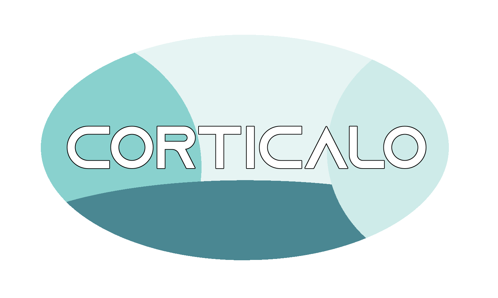
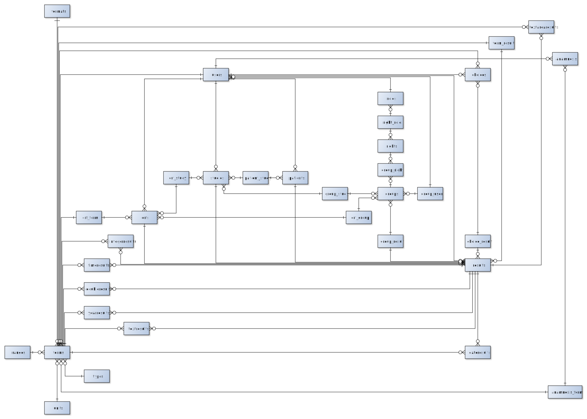

Der Service-Provider **corticalo** vom Projektteam **trial404** ist ein Prototyp für ein Studienmanagementsystem, mit dem Studiengruppen ihre Studien
organisieren sowie durchführen können. Kernstück bildet dabei der «electronic case report form» (elektronischer
Prüfbogen, kurz: eCRF).
Ziel des gesamten Projekts war es, dass der Studienleiter bzw. die Studiengruppe Fragen verschiedenen Typs
definieren und zu einem eCRF zusammenfassen kann. Dieser eCRF kann anschließend den Studienteilnehmern
bereitgestellt werden. Die erhobenen Daten werden am Ende zentral in einer Datenbank persistiert. Insgesamt
sollen die beteiligten Akteure einer klinischen Studie effizienter zusammenarbeiten können (Ermöglichung einer
ortsunabhängigen Kollaboration). Außerdem soll die Studiendauer effizienter genutzt werden, indem unnötige
Prozesse gestrichen werden sollen. Zum Beispiel soll es nicht mehr nötig sein, dass der CRF ausgedruckt und an
den Studienteilnehmer postalisch gesendet wird. Des Weiteren muss der Anwender den Prüfbogen nicht mehr
handschriftlich ausfüllen und wieder per Post zurückschicken. Zu guter Letzt erspart man den Mitarbeitern das
aufwändige manuelle Einpflegen der Daten in das Auswertungssystem. Alles in allem sollen alle Beteiligten einer
klinischen Studie enger miteinander verflochten sein und somit besser zusammenarbeiten können. Dieses Ziel
spiegelt auch der Name des Projekts, «corticalo» (englisch: corticalization, deutsch: Kortikalisierung =
Verschachtelung von Gehirnfunktionen), wieder.
Um das alles zu ermöglichen wurde eine plattformunabhängige Web-Applikation **[corticalo](https://corticalo.herokuapp.com/)**  erstellt.

# Vorgehensweise

Nach Analyse und Bewertung der Idee und den daraus resultierenden Nutzenversprechen, wurde analysiert, an welche Kundensegmente sich diese Nutzenversprechen richten. Daraus ergaben sich 3 große Kundensegmente: **Patienten**, **Ärzte** und **Studienleiter**. Zu diesen Segmenten wurden anschließend Personas erstellt, um ein besseres Verständnis zu erlangen. Diese Erkenntnisse wurden anschließend für Modellierung von spezifischen Geschäftsprozessen und die technische Implementierung verwendet. Auf eine genauere Beschreibung der Kundensegmente sowie deren Personas wird an dieser Stelle verzichtet. Genauere Informationen finden sie in unserer **Projektskizze Abgabe 1**.

Nachdem die Basis geschaffen wurde, ging es zur Konzeption. Hierbei wurden zunächst Moodboards erstellt, die in Style Tiles und anschließend in Wireframes resultierten. Details zum Design finden sie in **Abgabe 2**. Auf Grundlage der Wireframes wurde dann ein **Prototyp** erstellt, welcher ebenfalls in Abgabe 2 zu finden ist.

Das Design, insbesondere die Farben und die Navigationsleiste inkl. Menü, konnte vollständig in der Web Applikation realisiert werden. Allerdings wurde, im Vergleich zum Prototyp, auf der **[Startseite](https://corticalo.herokuapp.com/)** das Hintergrundbild durch Partikel ersetzt. Außerdem wurden die nachfolgenden Inhalte (über uns, Funktionen, Anwender, Referenzen wurden nicht umgesetzt, da keine vorhanden sind) auf der Startseite des Prototyps auf Unterseiten aufgeteilt, damit die Ladezeit der Startseite verringert wird. Auf den Unterseiten findet sich das Design des Prototyps wieder, vor allem das Hintergrundbild mit Jumbotron. Ebenfalls wurden die Inhalte ähnlich angeordnet (container mit 3 Spalten und Justify-Content-Center).

Nachfolgend wird zunächst die Funktionalität der Web Applikation beschrieben. Dabei werden, basierend auf den Benutzergruppen/Personas, die entsprechenden **use cases** vorgestellt (Resultieren aus dem **Produktumfang im Kapitel 4 der Projektskizze**). Im Anschluss wird erläutert, wie die Web Applikation **technisch umgesetzt** wurde. Für die technische Umsetzung wurde vorher das Datenbankschema modelliert, da die Web Applikation viele Tabellen mit unterschiedlichen Abhängigkeiten beinhaltet. Die Logik und Funktionalität basiert damit auf grundlegend auf dem Datenbankmodell.

# Funktionalität

Der funktionale Umfang enthält grundlegend folgende Komponenten:

- Login mit verschiedenen Benutzerrollen: Patient/Besucher, Studienleiter, Arzt, Administrator
- Implementierung der Standardseiten: Login, Register, Index/Welcome (inkl. Unterseiten), Impressum, Datenschutz, Kontakt
- Social-Media wurde nur symbolisch eingebunden, es sind keine Profile hinterlegt
- **Hinweis:** Die Registrierung wurde geändert, um den Anforderungen zu entsprechen. Es soll möglich sein, dass sich ein User mit einer vordefinierten Rolle registrieren kann. Diese Rolle muss dafür dem RegisterController mitgegeben werden. Dazu wurde in **vendor/laravel/framework/src/Illuminate/Foundation/Auth/RegistersUsers.php** die Funktion **showRegistrationForm()** und die **[Register-View](https://corticalo.herokuapp.com/register)** um die Input-Felder Vorname, Nachname sowie die Select-Box Benutzerrolle erweitert
- 2-stufiger Eingabe-Prozess mit Formularen inkl. Validierung (session handling) für den **Studienleiter** (Studie anlegen und ggf. einem/mehreren CRFs zuordnen, CRF anlegen und einer/mehreren Studien zuordnen, Fragen erstellen und einem oder mehreren CRFs zuordnen). Die Erstellung der Studie beinhaltet einen 2-stufigen Prozess (Erstellformular-Erstellüberisicht-Persistierung), siehe **[Studie erstellen](https://corticalo.herokuapp.com/studies/create)**. Ein weiterer Prozess mit session handling findet man beim Benutzer mit der Rolle **Arzt**: Löschen einer Befragung. Dazu muss zunächst eine Befragung durchgeführt worden sein. Über die **[Befragungsübersicht](https://corticalo.herokuapp.com/answers)** gelangt man in die Detailansicht einer Befragung, sofern man die nötigen Rechte besitzt, ist eine Löschen-Schaltfläche sichtbar, die zum 2-stufigen Löschprozess führt.

## Umgesetzte Use Cases

#### Patient/Besucher

**Als Besucher möchte ich von einer Willkommensseite begrüßt und über das Thema sowie den Service-Provider informiert werden können**

- Implementierung einer optisch ansprechenden **[Indexseite](https://corticalo.herokuapp.com/)**, von der man zu den Unterseiten (**Funktionen, Anwender, über corticalo, User-Login, Impressum, Datenschutz, Kontakt**) navigieren kann.

**Als Besucher möchte ich bei weiterführenden Fragen den Service-Provider kontaktieren können**

- Implementierung einer Kontaktseite (inkl. Verweis auf Datenschutz und Eingabeüberprüfung). Nach dem Klick auf die Schaltfläche *Senden* erscheint eine Meldung, dass diese erfolgreich versendet wurde (per session(); Nachricht verschwindet beim nächsten Request)

**Als Besucher möchte ich mich einloggen bzw. ggf. registrieren können, um zum eigentlichen Benutzerbereich zu gelangen**

- Eine Authentifizierung ist über den **[User-Login](https://corticalo.herokuapp.com/login)** bzw. eine **[Registrierung](https://corticalo.herokuapp.com/register)** möglich, falls der Benutzer noch keinen Account hat.

#### Studienleiter

**Als Studienleiter möchte ich auf einem Dashboard alle für mich wichtigen Informationen überblicken können**

- Durch die Implementierung eines Benutzerrechtekonzepts lässt sich der Zugriff und die Ansicht bestimmter Bereiche kontrollieren. Welche Rechte man hat, erkennt man bereits an den Inhalten des **[Dashboards](https://corticalo.herokuapp.com/dashboard)**. Im oberen Bereich unterhalb der Navigationsleiste sieht man unter **Eingeloggt als**, mit welcher Rolle man eingeloggt ist (per default gibt es bereits die Rollen **Administrator, Studienleiter und Arzt**, mit jeweils unterschiedlichen Rechten). Des Weiteren werden in der Seitennavigation sowie im Inhaltsbereich des Dashboards nur die Kategorien angezeigt, zu denen man auch die entsprechenden Rechte besitzt!
- Jede Rolle besitzt bestimmte Rechte. Die Rechte betreffen die entsprechenden Kategorien (Studien, CRF, Fragen, Auswahlen, Patienten, Befragungen, Ergebnisse, Benutzerprofil, Benutzerrechte, Benutzerrollen). Zu jeder Kategorie kann man definieren, ob der jeweilige Benutzer Einträge sehen (jeweilige index-view allgemein lesend), Einträge erstellen (create), Einträge bearbeiten (edit) oder Einträge (delete) kann.

**Als Studienleiter möchte ich Studien erstellen können**

- Studien lassen auf zwei Wege erstellen (sofern man die Rechte dafür besitzt): über das **[Dashboard](https://corticalo.herokuapp.com/dashboard)** und über den **[Erstellbereich](https://corticalo.herokuapp.com/studies/create)**. 
- Wurden bereits Case Report Forms (CRF) erstellt, erscheint ein Auswahlfeld (Dropdown Multiselect-Box), in dem alle erstellten CRFs angezeigt sind. Einer Studie lassen sich keine, einem oder mehrere CRFs zuweisen.
- analog wird dies für bereits vorhandene Patienten angeboten.
- Bevor der Eintrag in der DB gespeichert wird, gelangt man zu einer Übersicht, wo man seine Eingabe bestätigen muss. Nach erfolgreichem Speichern wird man zur **[Studienübersicht](https://corticalo.herokuapp.com/dashboard)** weitergeleitet und es wird eine Nachricht unterhalb der Navigationsleiste angezeigt, ob der Eintrag erfolgreich gespeichert wurde oder ein Fehler aufgetreten ist (z.B. keine Berechtigung).

**Als Studienleiter möchte ich Case Report Forms (CRF) erstellen können**

- CRFs lassen sich ähnlich wie Studien erstellen, hier fehlt jedoch der 2-stufige Prozess mit Eingabeüberprüfung und -bestätigung.
- Existieren bei der Erstellung bereits Studien oder Fragen, dann sind entsprechende Auswahlfelder vorhanden. Ein CRF kann dabei keinem, einem oder mehreren Studien zugeordnet werden. Ein CRF kann keine, eine oder mehrere Fragen beinhalten.
- legt man den CRF vom Dashboard aus an, bleibt man auf der Dashboard-Seite (Seite wird lediglich neu geladen). Erstellt man einen CRF über den **[Erstellbereich](https://corticalo.herokuapp.com/crfs/create)** wird man anschließend auf die **[CRF-Übersicht](https://corticalo.herokuapp.com/crfs)** weitergeleitet. In beiden Fällen bekommt man im Anschluss eine Benachrichtigung, ob das Speichern erfolgreich war oder nicht.

**Als Studienleiter möchte ich Fragen für meine CRFs erstellen können**

- Erstellung ist wie bei Studien und CRFs auf 2 Weisen möglich.
- Bestehen bereits CRFs kann ich diese über ein entsprechendes Auswahlfeld auswählen. Eine Frage kann keinem, einem oder mehreren CRFs zugeordnet werden.
- **Besonderheit:** beim Erstellen einer Frage muss ich auswählen, um welchen Fragetypen es sich handelt (**Eingabe, Checkbox oder Radiobutton**)

- Bei Fragetyp-Auswahl **Eingabe:** wird per AJAX ein weiteres Auswahlfeld nachgeladen, in dem man angeben muss, in welchem **Format** die Eingabe getätigt werden kann. Es gibt 7 verschiedene Formate zur Auswahl: Textfeld, Textarea, Datum, Uhrzeit, Jahreszahl, Ganzzahl oder Gleitkommazahl. Entscheidet man sich für das Format **Ganzzahl oder Gleitkommazahl** wird ein weiteres Auswahlfeld per AJAX nachgeladen, in dem Man einen Wertebereich definieren kann. Außerdem besteht die Möglichkeit über die Schaltfläche *Einheit angeben* eine bestimmte Maßeinheit anzugeben (momentan sind 11 verschiedene Einheiten vordefiniert).

- Bei Fragetyp-Auswahl **Checkbox oder Radiobutton:** wird nichts nachgeladen. Nach dem Anlegen der Frage erscheint jedoch ein Hinweis, dass für diese Frage Auswahlmöglichkeiten benötigt werden. Die Hinweismeldung zeigt dafür eine Schaltfläche *zur Auswahlerstellung* an, die einem zum **[Erstellbereich](https://corticalo.herokuapp.com/choices/create)** navigiert.

**Falls meine erstellte Frage vorgegebene Antwortmöglichkeiten benötigt (Typ Checkbox oder Radiobutton), möchte ich als Studienleiter Auswahlmöglichkeiten für diese Frage definieren können**

- Man kann einer Frage keine, eine oder mehrere Auswahlen zuordnen. Auswahlen können nur einer Frage zugeordnet werden.
- Auf **[Auswahl-Übersichtsseite](https://corticalo.herokuapp.com/choices)** werden alle Fragen vom Typ **Checkbox oder Radiobutton** angezeigt. Dabei ist sofort ersichtlich, wenn eine Frage noch keine Auswahlmöglichkeiten besitzt.
- **Auswahl erstellen**: es erscheint ein Modalfenster, in dem man einen Auswahltext eingeben muss, außerdem erscheint per AJAX ein weiteres Auswahlfeld für Auswahl der Frage (**Achtung:** die Praxistests zeigen, dass es ein wenig dauert, bis das Frageauswahlfeld angezeigt wird. Daher bitte ein paar Sekunden warten, sonst lässt sich die Auswahl nich anlegen bzw. es erscheint eine Fehlermeldung)

**Als Studienleiter möchte ich meine erstellten Studien, CRFs oder Fragen im Detail anschauen können**

- wurde eine Studie, ein CRF oder eine Frage erstellt, kann man diese nicht nur über die entsprechende Übersichtsseite betrachten, sondern es gibt für den Eintrag eine detailliertere **Show-View**. Indem man von der Übersichtsseite auf einen Eintrag klickt, gelangt man zur Detailansicht, sofern man die Rechte hat.

**Als Studienleiter möchte ich meine erstellten Studien, CRFs oder Fragen sowie Auswahlen bearbeiten oder löschen können**

- ist man der Ersteller dieser Einträge und besitzt man die entsprechenden Rechte, werden auf den jeweiligen Übersichtsseiten die entsprechenden Schaltflächen dargestellt (Bearbeiten: **Button mit Zahnrädern**; Löschen: **Roter Button mit Mülleimer**)

**Als Studienleiter möchte ich beantwortete CRFs überblicken können**

- im Dashboad gibt es einen Bereich **Studien**, wo alle Studien aufgelistet wurden (wird angezeigt, wenn man die Rechte dafür hat). Ein Klick auf den Button mit dem Auge öffnet ein Modal mit einer Detailansicht

#### Arzt

**Als Arzt möchte ich auf einem Dashboard alle für mich wichtigen Informationen überblicken können**

- diese Funktionalität ist ähnlich wie für den Benutzer *Studienleiter*. Da der Arzt andere Rechte besitzt, bekommt dieser andere Inhalte angezeigt: Patienten, Befragungen und Studien.

**Als Arzt möchte ich Patienten erstellen können**

- Erstellung eines Patienten ist über die **[Erstellseite](https://corticalo.herokuapp.com/patients/create)** möglich. Nach dem Anlegen wird man auf die **[Patienten-Übersichtsseite](https://corticalo.herokuapp.com/patients)** weitergeleitet.

**Als Arzt möchte ich meinen erstellten Patienten im Detail betrachten können**

- über die Patienten-Übersichtsseite, indem auf einen Eintrag klickt, gelangt man zur Detailansicht des Patienten (sofern man die Rechte hat).

**Als Arzt möchte ich meinen erstellten Patienten bearbeiten und löschen können**

- sofern man die Rechte hat: werden in der Detailansicht des Patienten entsprechende Schaltflächen angezeigt zum Löschen bzw. Bearbeiten des Patienten.

**Als Arzt möchte ich eine Befragung mit meinen Patienten durchführen können**

- eine Befragung startet auf 2 Wegen: vom Dashboard oder von der **[Befragungsübersicht](https://corticalo.herokuapp.com/answers)**, indem man auf die Schaltfläche *Befragung starten* klickt. Es lffnet sich ein Modal, wo man zuerst eine Studie auswählen muss. Danach erscheint ein weiteres Feld, wo man einen entsprechenden CRF auswählen muss (Es werden nur die CRFs angezeigt, die der davor ausgewählten Studie zugeordnet wurden). Wurde noch kein CRF erstellt und der Studie zugeordnet, wird eine Hinweismeldung angezeigt. Ein Klick auf **Befragung starten** öffnet das **Erstellformular** der Befragung. Dort muss man nur noch den gewünschten *Patienten* auswählen und die Fragen durchgehen bzw. beantworten.

**Als Arzt möchte ich meine durchgeführten Befragungen detailliert anschauen, bearbeiten und löschen können**

- möchte ich nachschauen, was ich ausgefüllt habe, kann ich, sofern ich die Rechte habe, über die **Befragungsübersicht** zum jeweiligen beantworteten CRF navigieren. Außerdem werden mir entsprechende Schaltflächen zum Bearbeiten und Löschen angeboten.
- **Löschen:** erfolgt über einen 2-stufigen Prozess (*session handling*). Bevor der Eintrag endgültig gelöscht wird, gelange ich auf eine Zwischenseite, die mich noch einmal darauf hinweist, dass der Eintrag danach nicht mehr vorhanden ist.

#### Adaministrator

- der Admin hat per default alle Rechte. Er kann kann neue Rechte und neue Benutzerrollen erstellen und die Rechte einer Benutzerrolle zuordnen.

## Technische Umsetzung

Für die technische Umsetzung wurde zunächst die Datenbank modelliert

