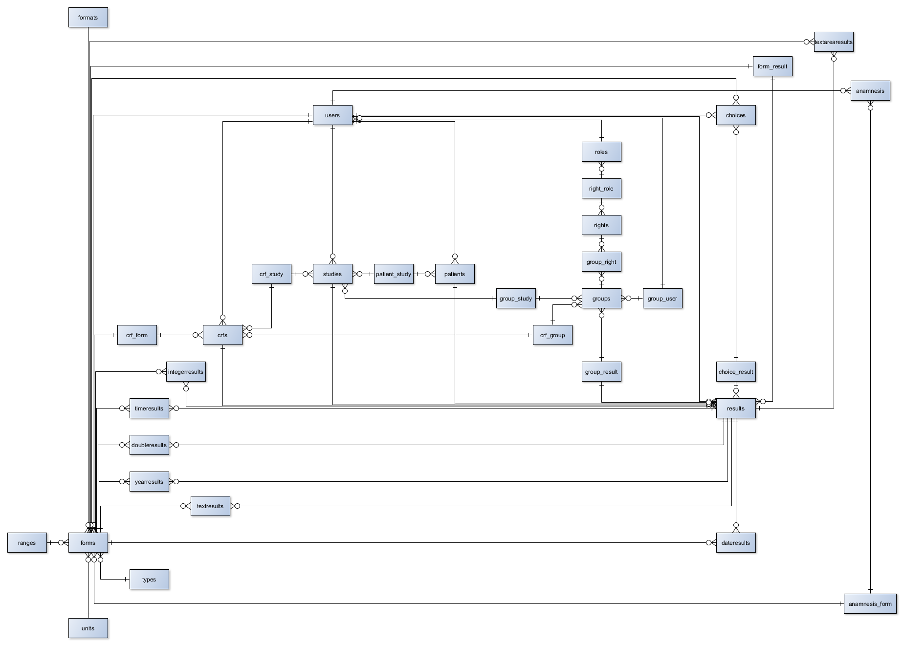

Entwicklung eines Prototypen für ein Studienmanagementsystem, mit dem Studiengruppen ihre Studien
organisieren sowie durchführen können. Kernstück bildet dabei der «electronic case report form» (elektronischer
Prüfbogen, kurz: eCRF).
Ziel des gesamten Projekts war es, dass der Studienleiter bzw. die Studiengruppe Fragen verschiedenen Typs
definieren und zu einem eCRF zusammenfassen kann. Dieser eCRF kann anschließend den Studienteilnehmern
bereitgestellt werden. Die erhobenen Daten werden am Ende zentral in einer Datenbank persistiert. Insgesamt
sollen die beteiligten Akteure einer klinischen Studie effizienter zusammenarbeiten können (Ermöglichung einer
ortsunabhängigen Kollaboration). Außerdem soll die Studiendauer effizienter genutzt werden, indem unnötige
Prozesse gestrichen werden sollen. Zum Beispiel soll es nicht mehr nötig sein, dass der CRF ausgedruckt und an
den Studienteilnehmer postalisch gesendet wird. Des Weiteren muss der Anwender den Prüfbogen nicht mehr
handschriftlich ausfüllen und wieder per Post zurückschicken. Zu guter Letzt erspart man den Mitarbeitern das
aufwändige manuelle Einpflegen der Daten in das Auswertungssystem. Alles in allem sollen alle Beteiligten einer
klinischen Studie enger miteinander verflochten sein und somit besser zusammenarbeiten können.
Um das alles zu ermöglichen wurde eine plattformunabhängige Web-Applikation **[corticalo](https://corticalo.herokuapp.com/)**  erstellt.

# Vorgehensweise

Nach Analyse und Bewertung der Idee und den daraus resultierenden Nutzenversprechen, wurde analysiert, an welche Kundensegmente sich diese Nutzenversprechen richten. Daraus ergaben sich 3 große Kundensegmente: **Patienten**, **Ärzte** und **Studienleiter**. Zu diesen Segmenten wurden anschließend Personas erstellt, um ein besseres Verständnis zu erlangen. Diese Erkenntnisse wurden anschließend für Modellierung von spezifischen Geschäftsprozessen und die technische Implementierung verwendet. Auf eine genauere Beschreibung der Kundensegmente sowie deren Personas wird an dieser Stelle verzichtet. Genauere Informationen finden sie in unserer **Projektskizze Abgabe 1**.

Nachdem die Basis geschaffen wurde, ging es zur Konzeption. Hierbei wurden zunächst Moodboards erstellt, die in Style Tiles und anschließend in Wireframes resultierten. Details zum Design finden sie in **Abgabe 2**. Auf Grundlage der Wireframes wurde dann ein **Prototyp** erstellt, welcher ebenfalls in Abgabe 2 zu finden ist.

Das Design, insbesondere die Farben und die Navigationsleiste inkl. Menü, konnte vollständig in der Web Applikation realisiert werden. Allerdings wurde, im Vergleich zum Prototyp, auf der **[Startseite](https://corticalo.herokuapp.com/)** das Hintergrundbild durch Partikel ersetzt. Außerdem wurden die nachfolgenden Inhalte (über uns, Funktionen, Anwender, Referenzen wurden nicht umgesetzt, da keine vorhanden sind) auf der Startseite des Prototyps auf Unterseiten aufgeteilt, damit die Ladezeit der Startseite verringert wird. Auf den Unterseiten findet sich das Design des Prototyps wieder, vor allem das Hintergrundbild mit Jumbotron. Ebenfalls wurden die Inhalte ähnlich angeordnet (container mit 3 Spalten und Justify-Content-Center).

Nachfolgend wird zunächst die Funktionalität der Web Applikation beschrieben. Dabei werden, basierend auf den Benutzergruppen/Personas, die entsprechenden **use cases** vorgestellt (Resultieren aus dem **Produktumfang im Kapitel 4 der Projektskizze**). Im Anschluss wird erläutert, wie die Web Applikation **technisch umgesetzt** wurde. Für die technische Umsetzung wurde vorher das Datenbankschema modelliert, da die Web Applikation viele Tabellen mit unterschiedlichen Abhängigkeiten beinhaltet. Die Logik und Funktionalität basiert damit auf grundlegend auf dem Datenbankmodell.

# Funktionalität

Der funktionale Umfang enthält grundlegend folgende Komponenten:

- Login mit verschiedenen Benutzerrollen: Patient/Besucher, Studienleiter, Arzt, Administrator
- Implementierung der Standardseiten: Login, Register, Index/Welcome (inkl. Unterseiten), Impressum, Datenschutz, Kontakt
- Social-Media wurde nur symbolisch eingebunden, es sind keine Profile hinterlegt
- **Hinweis:** Die Registrierung wurde geändert, um den Anforderungen zu entsprechen. Es soll möglich sein, dass sich ein User mit einer vordefinierten Rolle registrieren kann. Diese Rolle muss dafür dem RegisterController mitgegeben werden. Dazu wurde in **vendor/laravel/framework/src/Illuminate/Foundation/Auth/RegistersUsers.php** die Funktion **showRegistrationForm()** und die **[Register-View](https://corticalo.herokuapp.com/register)** um die Input-Felder Vorname, Nachname sowie die Select-Box Benutzerrolle erweitert
- 2-stufiger Eingabe-Prozess mit Formularen inkl. Validierung (session handling) für den **Studienleiter** (Studie anlegen und ggf. einem/mehreren CRFs zuordnen, CRF anlegen und einer/mehreren Studien zuordnen, Fragen erstellen und einem oder mehreren CRFs zuordnen). Die Erstellung der Studie beinhaltet einen 2-stufigen Prozess (Erstellformular-Erstellüberisicht-Persistierung), siehe **[Studie erstellen](https://corticalo.herokuapp.com/studies/create)**. Ein weiterer Prozess mit session handling findet man beim Benutzer mit der Rolle **Arzt**: Löschen einer Befragung. Dazu muss zunächst eine Befragung durchgeführt worden sein. Über die **[Befragungsübersicht](https://corticalo.herokuapp.com/answers)** gelangt man in die Detailansicht einer Befragung, sofern man die nötigen Rechte besitzt, ist eine Löschen-Schaltfläche sichtbar, die zum 2-stufigen Löschprozess führt.

## Umgesetzte Use Cases

#### Patient/Besucher

**Als Besucher möchte ich von einer Willkommensseite begrüßt und über das Thema sowie den Service-Provider informiert werden können**

- Implementierung einer optisch ansprechenden **[Indexseite](https://corticalo.herokuapp.com/)**, von der man zu den Unterseiten (**Funktionen, Anwender, über corticalo, User-Login, Impressum, Datenschutz, Kontakt**) navigieren kann.

**Als Besucher möchte ich bei weiterführenden Fragen den Service-Provider kontaktieren können**

- Implementierung einer Kontaktseite (inkl. Verweis auf Datenschutz und Eingabeüberprüfung). Nach dem Klick auf die Schaltfläche *Senden* erscheint eine Meldung, dass diese erfolgreich versendet wurde (per session(); Nachricht verschwindet beim nächsten Request)

**Als Besucher möchte ich mich einloggen bzw. ggf. registrieren können, um zum eigentlichen Benutzerbereich zu gelangen**

- Eine Authentifizierung ist über den **[User-Login](https://corticalo.herokuapp.com/login)** bzw. eine **[Registrierung](https://corticalo.herokuapp.com/register)** möglich, falls der Benutzer noch keinen Account hat.

#### Studienleiter

**Als Studienleiter möchte ich auf einem Dashboard alle für mich wichtigen Informationen überblicken können**

- Durch die Implementierung eines Benutzerrechtekonzepts lässt sich der Zugriff und die Ansicht bestimmter Bereiche kontrollieren. Welche Rechte man hat, erkennt man bereits an den Inhalten des **[Dashboards](https://corticalo.herokuapp.com/dashboard)**. Im oberen Bereich unterhalb der Navigationsleiste sieht man unter **Eingeloggt als**, mit welcher Rolle man eingeloggt ist (per default gibt es bereits die Rollen **Administrator, Studienleiter und Arzt**, mit jeweils unterschiedlichen Rechten). Des Weiteren werden in der Seitennavigation sowie im Inhaltsbereich des Dashboards nur die Kategorien angezeigt, zu denen man auch die entsprechenden Rechte besitzt!
- Jede Rolle besitzt bestimmte Rechte. Die Rechte betreffen die entsprechenden Kategorien (Studien, CRF, Fragen, Auswahlen, Patienten, Befragungen, Ergebnisse, Benutzerprofil, Benutzerrechte, Benutzerrollen). Zu jeder Kategorie kann man definieren, ob der jeweilige Benutzer Einträge sehen (jeweilige index-view allgemein lesend), Einträge erstellen (create), Einträge bearbeiten (edit) oder Einträge (delete) kann.

**Als Studienleiter möchte ich Studien erstellen können**

- Studien lassen auf zwei Wege erstellen (sofern man die Rechte dafür besitzt): über das **[Dashboard](https://corticalo.herokuapp.com/dashboard)** und über den **[Erstellbereich](https://corticalo.herokuapp.com/studies/create)**. 
- Wurden bereits Case Report Forms (CRF) erstellt, erscheint ein Auswahlfeld (Dropdown Multiselect-Box), in dem alle erstellten CRFs angezeigt sind. Einer Studie lassen sich keine, einem oder mehrere CRFs zuweisen.
- analog wird dies für bereits vorhandene Patienten angeboten.
- Bevor der Eintrag in der DB gespeichert wird, gelangt man zu einer Übersicht, wo man seine Eingabe bestätigen muss. Nach erfolgreichem Speichern wird man zur **[Studienübersicht](https://corticalo.herokuapp.com/dashboard)** weitergeleitet und es wird eine Nachricht unterhalb der Navigationsleiste angezeigt, ob der Eintrag erfolgreich gespeichert wurde oder ein Fehler aufgetreten ist (z.B. keine Berechtigung).

**Als Studienleiter möchte ich Case Report Forms (CRF) erstellen können**

- CRFs lassen sich ähnlich wie Studien erstellen, hier fehlt jedoch der 2-stufige Prozess mit Eingabeüberprüfung und -bestätigung.
- Existieren bei der Erstellung bereits Studien oder Fragen, dann sind entsprechende Auswahlfelder vorhanden. Ein CRF kann dabei keinem, einem oder mehreren Studien zugeordnet werden. Ein CRF kann keine, eine oder mehrere Fragen beinhalten.
- legt man den CRF vom Dashboard aus an, bleibt man auf der Dashboard-Seite (Seite wird lediglich neu geladen). Erstellt man einen CRF über den **[Erstellbereich](https://corticalo.herokuapp.com/crfs/create)** wird man anschließend auf die **[CRF-Übersicht](https://corticalo.herokuapp.com/crfs)** weitergeleitet. In beiden Fällen bekommt man im Anschluss eine Benachrichtigung, ob das Speichern erfolgreich war oder nicht.

**Als Studienleiter möchte ich Fragen für meine CRFs erstellen können**

- Erstellung ist wie bei Studien und CRFs auf 2 Weisen möglich.
- Bestehen bereits CRFs kann ich diese über ein entsprechendes Auswahlfeld auswählen. Eine Frage kann keinem, einem oder mehreren CRFs zugeordnet werden.
- **Besonderheit:** beim Erstellen einer Frage muss ich auswählen, um welchen Fragetypen es sich handelt (**Eingabe, Checkbox oder Radiobutton**)

- Bei Fragetyp-Auswahl **Eingabe:** wird per AJAX ein weiteres Auswahlfeld nachgeladen, in dem man angeben muss, in welchem **Format** die Eingabe getätigt werden kann. Es gibt 7 verschiedene Formate zur Auswahl: Textfeld, Textarea, Datum, Uhrzeit, Jahreszahl, Ganzzahl oder Gleitkommazahl. Entscheidet man sich für das Format **Ganzzahl oder Gleitkommazahl** wird ein weiteres Auswahlfeld per AJAX nachgeladen, in dem Man einen Wertebereich definieren kann. Außerdem besteht die Möglichkeit über die Schaltfläche *Einheit angeben* eine bestimmte Maßeinheit anzugeben (momentan sind 11 verschiedene Einheiten vordefiniert).

- Bei Fragetyp-Auswahl **Checkbox oder Radiobutton:** wird nichts nachgeladen. Nach dem Anlegen der Frage erscheint jedoch ein Hinweis, dass für diese Frage Auswahlmöglichkeiten benötigt werden. Die Hinweismeldung zeigt dafür eine Schaltfläche *zur Auswahlerstellung* an, die einem zum **[Erstellbereich](https://corticalo.herokuapp.com/choices/create)** navigiert.

**Falls meine erstellte Frage vorgegebene Antwortmöglichkeiten benötigt (Typ Checkbox oder Radiobutton), möchte ich als Studienleiter Auswahlmöglichkeiten für diese Frage definieren können**

- Man kann einer Frage keine, eine oder mehrere Auswahlen zuordnen. Auswahlen können nur einer Frage zugeordnet werden.
- Auf **[Auswahl-Übersichtsseite](https://corticalo.herokuapp.com/choices)** werden alle Fragen vom Typ **Checkbox oder Radiobutton** angezeigt. Dabei ist sofort ersichtlich, wenn eine Frage noch keine Auswahlmöglichkeiten besitzt.
- **Auswahl erstellen**: es erscheint ein Modalfenster, in dem man einen Auswahltext eingeben muss, außerdem erscheint per AJAX ein weiteres Auswahlfeld für Auswahl der Frage (**Achtung:** die Praxistests zeigen, dass es ein wenig dauert, bis das Frageauswahlfeld angezeigt wird. Daher bitte ein paar Sekunden warten, sonst lässt sich die Auswahl nich anlegen bzw. es erscheint eine Fehlermeldung)

**Als Studienleiter möchte ich meine erstellten Studien, CRFs oder Fragen im Detail anschauen können**

- wurde eine Studie, ein CRF oder eine Frage erstellt, kann man diese nicht nur über die entsprechende Übersichtsseite betrachten, sondern es gibt für den Eintrag eine detailliertere **Show-View**. Indem man von der Übersichtsseite auf einen Eintrag klickt, gelangt man zur Detailansicht, sofern man die Rechte hat.

**Als Studienleiter möchte ich meine erstellten Studien, CRFs oder Fragen sowie Auswahlen bearbeiten oder löschen können**

- ist man der Ersteller dieser Einträge und besitzt man die entsprechenden Rechte, werden auf den jeweiligen Übersichtsseiten die entsprechenden Schaltflächen dargestellt (Bearbeiten: **Button mit Zahnrädern**; Löschen: **Roter Button mit Mülleimer**)

**Als Studienleiter möchte ich beantwortete CRFs überblicken können**

- im Dashboad gibt es einen Bereich **Studien**, wo alle Studien aufgelistet wurden (wird angezeigt, wenn man die Rechte dafür hat). Ein Klick auf den Button mit dem Auge öffnet ein Modal mit einer Detailansicht

#### Arzt

**Als Arzt möchte ich auf einem Dashboard alle für mich wichtigen Informationen überblicken können**

- diese Funktionalität ist ähnlich wie für den Benutzer *Studienleiter*. Da der Arzt andere Rechte besitzt, bekommt dieser andere Inhalte angezeigt: Patienten, Befragungen und Studien.

**Als Arzt möchte ich Patienten erstellen können**

- Erstellung eines Patienten ist über die **[Erstellseite](https://corticalo.herokuapp.com/patients/create)** möglich. Nach dem Anlegen wird man auf die **[Patienten-Übersichtsseite](https://corticalo.herokuapp.com/patients)** weitergeleitet.

**Als Arzt möchte ich meinen erstellten Patienten im Detail betrachten können**

- über die Patienten-Übersichtsseite, indem auf einen Eintrag klickt, gelangt man zur Detailansicht des Patienten (sofern man die Rechte hat).

**Als Arzt möchte ich meinen erstellten Patienten bearbeiten und löschen können**

- sofern man die Rechte hat: werden in der Detailansicht des Patienten entsprechende Schaltflächen angezeigt zum Löschen bzw. Bearbeiten des Patienten.

**Als Arzt möchte ich eine Befragung mit meinen Patienten durchführen können**

- eine Befragung startet auf 2 Wegen: vom Dashboard oder von der **[Befragungsübersicht](https://corticalo.herokuapp.com/answers)**, indem man auf die Schaltfläche *Befragung starten* klickt. Es lffnet sich ein Modal, wo man zuerst eine Studie auswählen muss. Danach erscheint ein weiteres Feld, wo man einen entsprechenden CRF auswählen muss (Es werden nur die CRFs angezeigt, die der davor ausgewählten Studie zugeordnet wurden). Wurde noch kein CRF erstellt und der Studie zugeordnet, wird eine Hinweismeldung angezeigt. Ein Klick auf **Befragung starten** öffnet das **Erstellformular** der Befragung. Dort muss man nur noch den gewünschten *Patienten* auswählen und die Fragen durchgehen bzw. beantworten.

**Als Arzt möchte ich meine durchgeführten Befragungen detailliert anschauen, bearbeiten und löschen können**

- möchte ich nachschauen, was ich ausgefüllt habe, kann ich, sofern ich die Rechte habe, über die **Befragungsübersicht** zum jeweiligen beantworteten CRF navigieren. Außerdem werden mir entsprechende Schaltflächen zum Bearbeiten und Löschen angeboten.
- **Löschen:** erfolgt über einen 2-stufigen Prozess (*session handling*). Bevor der Eintrag endgültig gelöscht wird, gelange ich auf eine Zwischenseite, die mich noch einmal darauf hinweist, dass der Eintrag danach nicht mehr vorhanden ist.

#### Adaministrator

- der Admin hat per default alle Rechte. Er kann kann neue Rechte und neue Benutzerrollen erstellen und die Rechte einer Benutzerrolle zuordnen.

## Wow-Effekte

- ansprechende Startseite mit sich bewegenden Partikeln
- Responsives Dashboard
- Benutzerrechtekonzept
- Erstellung eines Prüfbogens (CRF): individualisierbar, da man selbst Fragen unterschiedlichsten Typs und Formats erstellen und zuweisen kann, inkl. leichter Plausibilitätsprüfung, da man Wertebereiche und Maßeinheiten vordefinieren kann
- Mehrfachverwendung von Fragen
- Mehrfachverwendung von CRFs/Prüfbögen

# Technische Umsetzung

Für die technische Umsetzung wurde zunächst die Datenbank modelliert. Gewisse Tabellen wie **anamnesis oder groups** wurden zwar mit aufgenommen, allerdings wurde diese aufgrund mangelnder Zeit nicht vollständig umgesetzt. Zudem waren sie nicht im vordefinierten Produktumfang enthalten.

Im folgenden Abschnitt wird nun für jedes Vorlesungskapitel erläutert, wie die Web Applikation umgesetzt wurde. Dabei werden **nicht** alle implementierten Komponenten vorgestellt. Es soll lediglich dargestellt werden, dass die Anforderungen der jeweiligen Vorlesung umgesetzt wurden. 

Prinzipiell wurde sich nicht ganz an den Vorlesungsplan gehalten. Grund dafür ist das Datenmodell, welches relativ komplex wurde. Die korrekte und saubere Ausarbeitung der Datenbank war unabdingbar für erfolgreiches weiteres Vorgehen, da diese das Fundament der Applikation bildet. Aus diesem Grund haben wir unsere Implementierung folgendermaßen gegliedert:

- Modellierung der Datenbank
- Erstellung des Laravel-Projects
- Umsetzung **Model-Schicht:** Erzeugung der Models inkl. Migrations sowie Laravel-Auth - Erzeugung einer lokalen Testtabelle - Erste Migration - Erzeugung von Migrations für die Fremdschlüsselbeziehungen (one-to-many, many-to-many) - zweite Migration - Erstellung DatabaseSeeder für Test-/Initialdaten
- Umsetzung **Controller-View-Schicht:** Erstellung und Kapselung des Layouts (**resources/views/layouts** und **resources/views/inc**) - Einteilung der Umsetzung in Pakete (in *resources/views/*: Studien **studies**, CRFs **crfs**, Fragen **forms**, Auswahlen **choices**, Patienten **patients**, Befragungen **answers**, Rollen **roles**, Rechte **rights**, User **user**, Willkommensseite **pages**) - Definition der Routes in *routes/web.php*
- Umsetzung Javascript/Jquery/Ajax
- Deployment

Nachfolgend werden diese Punkte anhand des Bereichs **Fragen** (im code werden Fragen hauptsächlich als **forms** bezeichnet) beschrieben. Die anderen Bereiche wurden ähnlich implementiert, da in ziemlich allen Paketen eine vollständige CRUD-Funktionalität umgesetzt wurde.   

## Erstellung Laravel-Projekt

Erstellung des Projekts ist sehr einfach dank Laravel und Composer, daher wird hier nicht weiter darauf eingegangen, außer dass es erfolgreich verlief. Die ersten Arbeiten wurden über ein privates Github-Repository durchgeführt, ehe die Arbeit auf Gitlab weitergeführt wurden.

## Umsetzung Model-Schicht

Die Implementierung vollzog sich äußerst angenehmen, **php artisan make:model** sei dank. Die Modelklassen sind grundlegend im Ordner **app/** zu finden.

Mithilfe von *php artisan make:model Form -m* wird ein Model in diesem Ordner erzeugt sowie eine zugehörige Migration, welche unter **database/migrations** zu finden ist. In der Migration lassen sehr einfach die Spalten definieren. Für das Model *Form* wird zugehörig eine Tabelle in der DB mit dem Namen **forms** mit den Spalten **id** (incrementes('id') => per default Primary Key) und **frtext** (für den eigentlichen Fragetext) sowie den Zeitstempeln **created_at und updated_at** (durch timestamps() in der Migration) mithilfe der erzeugten *migration* erstellt.

Die Tabelle mit den definierten Spalten wird einfach mit dem Befehl *php artisan migrate* erstellt. Wichtig an dieser Stelle ist, dass vorher eine Datenbank erstellt werden muss, wohin die Tabelle migriert werden kann.

Anschließend wurden Fremdschlüsselbeziehungen definiert und migriert. Wichtige Anmerkung, Foreign Keys bzw. Junction Tables lassen sich erst migrieren, wenn die jeweiligen Tabellen existieren, auf die sie sich beziehen. Das heißt, es müssen erst alle Basistabellen angelegt werden.

Anschließend wurde die **forms-Tabelle** um die Spalten mit den Fremdschlüsseln **formtype_id, format_id, unit_id, range_id und user_id** erzeugt. Zu diesen Tabellen bestehen jeweils one-to-many-Beziehungen (*formtype* für den Fragetypen, *format* für das Eingabeformat, *unit* für die Maßeinheit, *range* für den Wertebereich, *user* für den Benutzer/Ersteller). Da eine Frage vom Typ *Checkbox oder Radiobutton* keine weiteren Angaben erfordert, können Format, Einheit und Wertebereich null sein (*nullable()*).

Die Beziehung der jeweiligen Tabellen lässt sich dank Eloquent sehr einfach darstellen bzw. definieren. Bspw. wurde in **app/Form.php** die Beziehung zu Fragetypen (**app/Formtype.php**) durch die Funktion **formtypes()** mit dem Methodenrumpf **return $this->belongsTo('App\Formtype');** implementiert. Analog dazu wurde in app/Formtype.php die Funktion **forms()** mit **return $this->hasMany('App\Form');** implementiert. 

Ähnlich wurden **many-to-many**-Beziehungen definiert, nur das dafür **junction tables** erstellt wurden. Um solch eine Beziehungen zum Model **CRF** herzustellen, wurde eine migration **crf_form**, die eine gleichnamige Tabelle in der DB erzeugt, erstellt. Wichtig ist hier, dass Eloquent alphabetisch vorgeht, daher ist die Anordnung *crf_form* bewusst so gewählt, sonst kann es später zu Problemen kommen, da Eloquent diese junction table nicht würde, sofern dieser Tabellenname nicht extra definiert wurde!

Innerhalb dieser Migration wurden die beiden Spalten **crf_id** und **form_id** als Foreign Key definiert:

**$table->foreign('form_id')->references('id')->on('forms')->onDelete('cascade');**

*form_id* ist ein Fremdschlüssel und bezieht sich auf die Spalte *id* in der Tabelle *forms*. Es wurde zusätzlich noch definiert, was passieren soll, wenn eine Frage gelöscht wird; in diesem Fall *cascade*.

Anschließend muss diese Beziehung noch in den jeweiligen Models definiert werden:

in **app/Form.php**: 

**public function crfs()** mit der Implementierung **return $this->belongsToMany('App\CRF', 'crf_form', 'form_id', 'crf_id');**

in **app/CRF.php**: 

**public function forms()** mit der Implementierung **return $this->belongsToMany('App\Form' , 'crf_form', 'crf_id', 'form_id');** 

In der view lässt sich das anschließend sehr angenehm verwenden um bspw. eine Liste aller Fragen, die einem bestimmten CRF zugeordnet sind, auszugegeben:

**@foreach($crf->forms as $form) @endforeach**

innerhalb dieser Schleife lassen sich dann alle Fragen mit dem entsprechenden Fragetext ausgeben:

**{{ $form->frtext }}**

Die genaue Umsetzung kann man in **views/crfs/index**, **views/crfs/show** oder **views/forms/index** **views/forms/show** nachvollziehen.

#### Erstellung DatabaseSeeder

Damit ein Login bzw. Registrierung sowie Anlegen von Fragen möglich ist, bedarf es initialer Werte in der Datenbank. Dies wurde über den **database/seeds/DatabaseSeeder.php** realisiert. Dieser beinhaltet die Erstellung von 3 Benutzern mit verschiedenen Benutzerrechten/-rollen. Außerdem wurden die Tabellen **formats, formtypes und units** mit Werten gefüllt, damit eine Erstellung von Fragen möglich ist.

**Vorgehen:**

1. php artisan migrate oder falls man die DB neu aufsetzen möchte: php artisan migrate:fresh
2. php artisan migrate:seed füllt die DB mit den Werten aus dem *DatabaseSeeder*

## Controller-View-Sicht

Alle Controller sind in **app/Http/Controllers** zu finden.
Um jetzt Inhalte aus der DB über ein Model im Frontend darstellen zu können, sind folgende Schritte nötig:

1. Erstellung eines Controllers, der die Daten aus der DB entgegennimmt und an die View weiterleitet
2. Erstellung einer Route, damit die Inhalte auch in die richtige View gelangen

### Controller

***php artisan make:controller FormsController -resource**

- Command erzeugt einen Controller für *Fragen* bzw. *forms*. Durch *-resource* werden mit der Erstellung des Controller gleichzeitig die grundlegenden Methoden für eine CRUD-Funktionalität miterstellt (index(), create(), store(), show(), edit(), update(), destroy()). Diese Methoden wurden anschließend implementiert und in *routes/web.php* registriert durch **Route::resource('forms', 'FormsController')**. 
- Damit ferner Daten aus der DB ausgelesen werden können, müssen die entsprechenden Models importiert werden durch: **use App\Form;**

Die durch Artisan mitgelieferten Methoden wurden außerdem um weitere Methoden erweitert:
- **getformats()**: zur Realisierung eines asynchronen Prozesses. Wichtig beim Erstellen einer Frage. Zu finden beim **[Erstellen einer Frage](https://corticalo.herokuapp.com/forms/create)**.  Nähere Informationen werden im Bereich Javascript/jQuery/Ajax erläutert.
- **geteditformats():** zur Realisierung eines asynchronen Prozesses. Wichtig beim Bearbeiten einer Frage
- **getranges():** zur Realisierung eines asynchronen Prozesses. Wichtig beim Erstellen einer Frage. Zu finden beim **[Erstellen einer Frage](https://corticalo.herokuapp.com/forms/create)**. 
- **getsavedranges():** zur Realisierung eines asynchronen Prozesses. Wichtig beim Bearbeiten einer Frage
- **getunits():** zur Realisierung eines asynchronen Prozesses. Wichtig beim Erstellen einer Frage. Zu finden beim **[Erstellen einer Frage](https://corticalo.herokuapp.com/forms/create)**.
- **getsavedunits():** zur Realisierung eines asynchronen Prozesses. Wichtig beim Bearbeiten einer Frage
- **storeForms():** Dadurch ist ein Speichern einer Frage vom Dashboard aus möglich
- **addForm():** Zu finden, wenn man einen angelegten CRF bearbeiten möchte. Über *Erstelle Frage* öffnet sich ein Modal, worüber, dank der Funktion *addForm*, ein Anlegen einer oder mehrerer Fragen möglich ist
- **destroyAsync():** wird für einen asynchronen Löschvorgang einer Frage vom Dashboard aus benötigt.

*Diese Funktionen müssen, damit sie auch richtig benutzt werden können, in **routes/web.php** registriert werden.*

Die Funktionen im FormsController leiten außerdem zu den entsprechenden views weiter. Die Funktionen *index, create, show oder edit* bspw. geben eine **view** mit entsprechenden Variablen (**with('foo', $foo)**) zurück, Funktionen wie *store oder update* leiten per **redirect()** zu Ausgangsseiter bzw. einer anderen Seite weiter.

### View

**resources/views/forms** 

Hier sind alle wichtigen view-Dateien für den Bereich *Fragen* vorhanden: create, edit, index und show. Alle haben den Suffix **.blade.php**

Jedes sog. Blade-Template ist prinzipiell gleich aufgebaut:

- *@extends('layout.dateiName.blade.php)*: Angabe, welches Layout erweitert wird. Wird im jeweiligen Layout angezeigt durch *@yield('content')*
- *@section('content') ... @endsection:* innerhalb dieses Blocks wird der eigentliche Inahlt definiert.
- innerhalb der section: *@section('title') ... @stop*: Hier wird ein Titel für die Seite definiert, der Browser-Tab sichtbar ist

Views, die während des Erstellens einer Frage asynchron nachgeladen werden, befinden sich in **resources/views** ganz unten: *geteditformats, getformats, getranges, getsavedranges, getsavedunits, getunits*

## Session Handling

Wie bereits erwähnt existieren 2 Prozesse, wo Daten in einer Session gehalten werden:

1. **[Erstellen einer Studie](https://corticalo.herokuapp.com/studies/create)**
2. **Löschen einer Befragung**: In der Detailansicht einer Studie wird bei entsprechender Berechtigung eine Löschen-Schaltfläche angeboten

**Erstellen einer Studie**

Hat man alle relevanten Felder angegeben und auf *anlegen* geklickt, gelangt man auf eine Bestätigungsseite. Erst danach wird der Eintrag in der DB gespeichert.

Das Erstellformular beinhaltet folgende *action*: **'action'=> 'StudiesController@showOverview'**

Das sorgt dafür das die Funktion *showOverview* im *StudiesController* aufgerufen wird. Diese Funktion nimmt den Request entgegen und sichert die Eingaben in einer *session*. Anschließend gibt die Funktion eine *view* unter Route */studies/overview* zurück. Diese Route ist natürlich auch in *routes/web.php* registriert. Dadurch öffnet sich eine Übersichtsseite, wo noch einmal alle Eingaben angezeigt werden und man aufgefordert wird, diese zu bestätigen. Ansonsten kann man den Erstellprozess abbrechen, indem man die Schaltfläche *zurück* drückt.
Mit dem Drücken der *Studie speichern*-Schaltfläche wir die *store*-Funktion des *StudiesController* aufgerufen. Diese Funktion liest dann zunächst die gespeicherten Daten aus der Session aus und speichert sie dann in der DB.

Mit Sessions wurde zudem auch in **resources/views/inc/messages.blade.php** gearbeitet. Speichert ein Benutzer einen Eintrag, wird ihm anschließend eine succes-Nachricht angezeigt, welche beim nächsten Request wieder verschwindet. Diese Benachrichtigungen wurden außerdem für etwaige Fehlermeldungen (bspw. kein Zugriffsrecht) oder Hinweismeldungen (bspw. nach Erstellen einer Frage vom Typ Checkbox || Radiobutton).

## Authentifizierung und Autorisierung

Die Authentifizierung wird glücklicherweise durch Laravel immens unterstützt. Nachdem durch *php artisan make:auth* die Laravel-Authentication eingebunden wurde, lassen sich die Routes in der *routes/web.php* durch **Auth::routes()** schützen. Außerdem wurden die Funktionen in jedem Controller durch die eingebundene *middleware* im Konstruktor **_construct()** geschützt: äußerst hilfreich ist hierbei **middleware('auth'):** der Benutzer muss eingeloggt sein für einen Zugriff. 
Außerdem wurde eine eigene middleware benutzt. Diese nimmt zunächst den Request entgegen, prüft zunächst, ob der eingeloggte Benutzer eine Benutzerrolle besitzt bzw. ob diese Benutzerrolle überhaupt Benutzerrechte beinhaltet, wenn ja, dann gibt die middleware den Request weiter. Ansonsten wird der Zugriff verweigert und der Benutzer gelangt zurück zum Dashboard und erhält eine Fehlermeldung.
*siehe Konstruktor im FormsController*

Außerdem ist jede Funktion auch noch einmal geschützt. Zum Beispiel wird in der index()-Funktion im FormsController, bevor diese Funktionen die angefragte View zurückgibt, geprüft, ob der eingeloggte Benutzer das Recht besitzt, die Index-View des Fragenbereichs aufzurufen:

**foreach ($role->rights as $right):** 
gehe alle der Rolle zugehörigen Rechte durch..
            **if ($right->formindex == 1):**
            und prüfe, ob der Benutzer mit seiner erteilten Rolle das Recht *formindex* besitzt.
            Wenn ja, leite weiter. Wenn nein, leite zurück zum Dashboard.

Diese Implementierung findet sich in allen Funktionen in allen Controllern wieder, sofern diese nicht frei zugänglich sein dürfen!

Diese Authorisierungsprüfungen wurden zusätzlich auch in den Views eingebaut. Insbesondere in der **Dashboard-View**, welche in *resources/views* liegt.
Hier wird für jede *Card* das jeweilige benötigte Recht geprüft. Dafür wird zunächst mit einer foreach-Schleife durch die gesamte Rechte-Tabelle iteriert und geprüft, ob der Benutzer mit seiner Benutzerrolle das notwendige Recht besitzt. Wenn ja, dann wird ihm die *Card* im Dashboard angezeigt. Das gleiche Vorgehen wurde in der Seitennavigation implementiert, welche unter **resources/views/inc/sidebarNew.blade.php** abgelegt ist.
Authorisierung wurde auch in **resources/views/inc/menu.blade.php** (Vollbildmenü, welches angezeigt wird, wenn man den Menübutton in der Navigation drückt) und in **resources/views/inc/navigationNew.blade.php** (Dashboard-Button wird nur angezeigt, wenn der User erfolgreich eingeloggt ist).

## JavaScript/JQuery/Ajax

JavaScript (JS) und Asynchrone Prozesse finden sich an unzähligen Stellen wieder. Daher werden nur einige Funktionen vorgestellt. Das Bootstrap ebenfalls JQuery benutzt, wird nicht näher erläutert.

Bereits das Öffnen des Vollbild-Menüs wurde mit mithilfe von JS gelöst. Durch Drücken des Menüs wird die Funktion **openNav()** aufgerufen, die in **public/js/menu.js** gespeichert ist. In dieser Datei befinden sich auch alle relevanten Ajax-Funktionen, die für die Erstellung einer Frage benötigt werden.

Im Ordner *public/js* finden sich außerdem eine Vielzahl weiterer wichtiger Dateien:
- *myScript.js:* ist wichtig für die Implementierung der Partikel auf der Startseite. Dazu werden noch *particle.js und particlejs-config.json* benötigt.
- *select2Use.js:* ist wichtig, damit die Multiselect-Boxen verwendet werden können (zu finden beim Erstellen einer Studie, wenn man vorhandene CRFs oder Patienten auswählen möchte). Dazu benötigt es die *select2.full.js*-Bibliothek

Weitere wichtige JS-Funktionen finden sich in **resources/assets/js/custom.js**:

Hier sind vor allem asynchrone Löschfunktionen mithilfe von *JQuery* und *axios* implementiert. Diese werden z.B. verwendet, wenn man im Dashboard eine Studie, einen CRF oder eine Frage löschen möchte. Drückt man auf die Löschen-Schaltfläche, erscheint eine Hinweismeldung, die nachfragt, ob man sich sicher ist. Wenn man bestätigt, wird über **axios** ein asynchroner Löschvorgang angestoßen. Hierbei wurde vor allem mit sogenannten Promises gearbeitet:
- axios ruft einen delete-Request an die angegebene URL auf, war dieser erfolgreich wird der *.then()*-Block ausgeführt, wenn nicht, wird dieser Fehler im *.catch()*-Block aufgefangen. 

Die *custom.js*-Datei wird dann wie die StyleSheets in *resources/assets/sass/* dank Laravel-Mix und Webpack überprüft und optimiert. Die kompilierten Versionen werden dann unter *public/js/app.js* oder *public/css/app.css* abgelegt.
In der **webpack.mix.js**-Datei kann man außerdem definieren, welche Dateien kompiliert und an welchen Ort die optimierten Versionen abgelegt werden sollen.

# Performance und SEO

Die Startseite wurde verschlankt und die Inhalte wurden auf Unterseiten verteilt. Dadurch sollte die Ladezeit der Startseite reduziert werden (nicht sichtbare Bilder werden nicht geladen). Allerdings beanspruchen die Partikel nachwievor viel Ladezeit.

Ansonsten wurden mithilfe von Laravel-Mix Stylesheets und JS-Dateien komprimiert und Bilder wurden im PJPEG-Format gespeichert.

Für die Suchmaschinenoptimierung wurden in den Meta-Tags eine Beschreibung und Stichwörter definiert. Außerdem wurde begonnen auf einschlägigen Seiten wie *Google My Business*, *Bing Local* oder *Yahoo Local* den Service-Provider zu platzieren.

Ob und inwiefern diese Maßnahmen erfolgreich sein werden, lässt sich zum jetzigen Zeitpunkt allerdings nicht feststellen.

# Teamwork & Erkenntnisse

Am Anfang stand man vor einem Berg an Arbeit. Einige Use Cases schienen unmöglich zu lösen, vor allem der Fragenbereich sowie der Befragungs- bzw. Antwortbereich. In der ersten Phase hat man daher viel zu gemeinsam analysiert, diskutiert, modelliert und programmiert. Das verringerte die Unsicherheit, deckte Fehler schneller auf und man stieß auf neue Erkenntnisse. Die Lernkurve war bei unserem Projekt äußerst steil. Es gab unzählige Stellen, die einem einen Schritt zurückwarfen, wie das Berechtigungskonzept, doch die Lösung brachte uns anschließend 3 Schritte nach vorn. Am Ende konnten wir uns die Arbeitspakete gut aufteilen, indem der eine bspw. die Startseite bearbeitete und dort leichtere Programmierarbeiten und dafür ungeliebte und zeitaufwendige redaktionelle Arbeiten (verfassen der Texte, Gliederung der Themen und Seiten) verrichtete. Gleichzeitig konnte der andere im Backend aufgetretene Mängel beheben. Ansonsten ließen sich aufgrund des MVC-Ansatzes die Arbeiten gut aufteilen, da das Projekt unterschiedliche Bereiche bzw. Pakete bereithielt (z.B. die Bereiche Studien, CRFs, Fragen, Patienten). Diese konnten am Anfang problemlos simultan implementiert werden.

Insgesamt sind wir sehr zufrieden mit dem Projekt, es war zwar anstrengend, aber es hat dennoch Spaß gemacht.
Nach unserer internen Lessons Learned konnten wir natürlich einige Baustellen identifizieren, die man in einem zweiten Projekt angehen könnte. Das betrifft vor allem die inhaltliche Konzeption: Der Bereich *klinische Studien* unterliegt strengen gesetzlichen Vorschriften. Gesetzliche Vorgaben, wie ein Audit-Trail (ähnlich einer Versionsverwaltung), konnten aufgrund mangelnder Zeit nicht umgesetzt werden. Dieser Punkt war jedoch nicht im Projektumfang definiert. Weiterer Nachholbedarf besteht in der Usability und User-Experience: mit mehr Zeit und Manpower lassen sich definitiv einige Abläufe optimieren und nutzerfreundlicher gestalten.
Außerdem besteht Verbesserungspotenzial im Bereich Suchmaschinenmarketing (SEA und SEO) sowie Performance und Security.

Dies sind alles Aspekte, die für einen Go-Live unabdingbar sind und die wir nur anschneiden konnten. Allerdings lag unser Hauptfokus in der Konzeption und Entwicklung einer Web Applikation
